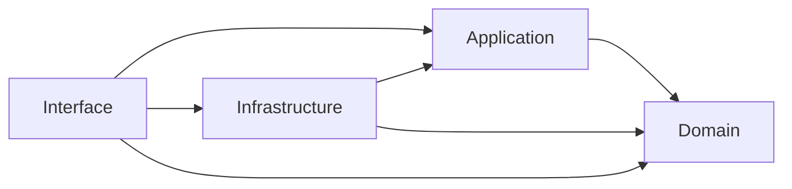

# Hotel Room Booking Coursework

A small four-member DDD, TDD and Clean Architecture project. Two connected
use cases confirm a booking and process its requested room reservation.
Persistence is in memory. Payments, authentication, a web interface,
production databases and deployment are outside the scope.

## Run

```powershell
py -m pip install -r requirements.txt
py -m pytest -v
py -m interface.main
```

Use `python` instead of `py` where appropriate. The console demonstrates a
successful booking followed by rejection of an overlapping booking.

## Six business rules

| Rule | Statement | Responsible code | Violation outcome | Test |
| --- | --- | --- | --- | --- |
| BR1 | Checkout must be after check-in. | `domain/booking_dates.py`: BookingDates | ValueError; application returns failure. | T1 |
| BR2 | Only Pending bookings can become Confirmed or Cancelled. | `domain/booking.py`: Booking | ValueError; existing state is preserved. | T2 |
| BR3 | A Room cannot accept overlapping reservations. | `domain/room.py`: Room.reserve | ValueError; existing reservations are preserved. | T3 |
| BR4 | Total price is the nightly rate multiplied by nights. | `domain/booking_pricing_service.py`: BookingPricingService | Invalid rates or nights raise ValueError; application returns failure. | T4 |
| BR5 | Confirming Booking requests a reservation in Room through an event. | `domain/events.py`: BookingConfirmed; `infrastructure/event_handler.py`: RoomReservationHandler | Handler reports rejection; Room stays unchanged and attempted Booking is not saved. | T5 |
| BR6 | The requested Room must exist before booking proceeds. | `application/booking_service.py`: BookingService; RoomRepository | Failure DTO; no booking or event handling. | T6 |

## Domain model and contracts

Booking and Room are the two aggregate roots, identified by `booking_id`
and `room_id`. Booking protects its lifecycle. Room owns immutable Reservation
records, references Booking only by ID, and protects its non-overlap invariant.
Callers inspect `room.reservations` through a read-only tuple.

`BookingDates(check_in, check_out)` is an immutable value object taking
`datetime.date` values. Equal date pairs are equal values with no separate
identity. `dates.nights` returns the stay length. Checkout is exclusive:
October 1-4 and October 4-6 are adjacent, not overlapping.

`Room(room_id, room_number, room_type, nightly_price)` accepts reservations
through `reserve(booking_id, dates)`. Stored records are active reservations;
reservation cancellation is outside the current workflow.

`BookingPricingService.calculate_price(room_price, nights)` combines the
room's rate and the stay's nights, returning Decimal money. Rates must be
finite and non-negative; nights must be positive integers. Zero rates are
allowed. Taxes, discounts and currency conversion are outside scope.

`Booking(booking_id, room_id, guest_name, dates, total_price)` starts Pending.
`confirm()` returns `BookingConfirmed(booking_id, room_id, dates)`;
`cancel()` changes only a Pending booking. Display status with
`booking.status.value`. Booking never retrieves or directly changes Room.

No Factory is needed because creation uses simple constructors. A Layer
Supertype is a common base class for shared behaviour within a layer; none
is used because this domain has no such shared behaviour to extract.
The repository ABCs define persistence contracts, not a shared domain base.

## Architecture and event flow

Domain contains the business objects and rules. Application contains
BookingService, MakeBookingRequest/MakeBookingResult DTOs, one repository
abstraction per root and the handler contract. Infrastructure implements
the repositories and event handler. Interface wires them together through
`build_service()` and calls the use case. Repositories expose `get(id)` and
`save(entity)` and store aggregates in dictionaries keyed by identity.

Arrows below mean source-code imports:



The use-case flow is:

`MakeBookingRequest -> BookingService -> Booking.confirm -> BookingConfirmed -> RoomReservationHandler -> Room.reserve -> MakeBookingResult`

BookingService retrieves Room (BR6), builds dates (BR1), calculates price
(BR4), creates and confirms Booking (BR2), and passes the returned event to
the injected handler (BR5). Room then checks its own overlap invariant (BR3).

On success the handler saves Room, the service saves Booking and returns
success. On reservation rejection Room remains unchanged, the attempted
Booking is not saved and the returned DTO reports failure. Its transient
Booking object was confirmed, but is discarded rather than cancelled;
there is no Confirmed-to-Cancelled transition. This is a small synchronous,
in-memory workflow, without a production rollback or transaction mechanism.

## Eight tests and evidence

| Test | Checks |
| --- | --- |
| T1 | Reject equal/reversed dates; accept the one-night boundary; value equality and immutability. |
| T2 | Permit Pending transitions and reject transitions from terminal states. |
| T3 | Reject overlap shapes without mutation; accept adjacent stays; protect reservation records. |
| T4 | Calculate exact money from rate and nights; reject invalid inputs. |
| T5 | Real Booking confirmation produces the event; real handler requests Room reservation. |
| T6 | Missing Room stops the use case before event handling or persistence. |
| T7 | Successful main use case stores Booking and changes Room through the event. |
| T8 | Real overlapping follow-up fails; existing reservations remain and attempted Booking is absent. |

T1, T2 and T3 include rejection cases; T1 also provides a boundary case.
`evidence/final-tests.txt` contains the final eight-test run and
`evidence/final-console.txt` contains the console walkthrough output.

For Slide 12, use BR1's actual TDD evidence: `evidence/member2-red.txt`
shows T1 failing against BookingDates without validation;
`evidence/member2-green.txt` shows the same test passing after implementing
the rule. Original member evidence is retained as historical evidence.
Member 1's red/green files document the later Booking contract patch, not
the original implementation of BR2.

The required 15-slide deck remains a separate submission deliverable.
Use the rules, architecture, event flow and traceability above consistently
with the final code and tests.

AI use: OpenAI Codex helped review and implement domain components, tests,
TDD evidence, documentation and feature-branch integration.
